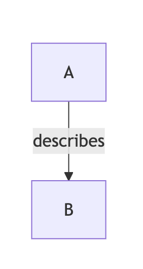

## Layout Direction
graph TD → Top Down
graph LR → Left Right
graph BT → Bottom Top

## Node Shapes
[ ] = rectangle
( ) = rounded
(( )) = circle
> ] = rhombus/decision

## Relationships (Edges)

## Live Editor
https://www.mermaidchart.com/play?utm_source=mermaid_live_editor&utm_medium=toggle#pako:eNptks1u2zAQhF9lIRQ9WbUk24LjQw61EfTHSYPEt6owCGpVEVG5AknHMIK8e5cWpShwLhLJ-YazS_IlklRitIriOC60JF2pv6tCAzTiRAe3AmyeCn0Wq4aOshbGwW7jCYCvqml-F5H_QVpEfyCOQVn-XsNGOGQpyafZbJol2ZzlN5MHa9GR98Ip1I7hH2SxreGWI-yAB9k7GpI8IT1ta9LYm1Fpt98GaX_vJd5rmS5yuCGD1sE3n_hQTuCn0JZT18qdePIIeZ4mV0PShqQjw96d0MrWAtZUVXgKfX0Q3hmGbJ-azGewFU9oVYmcYybwyzRClzSBmy3MsmWa-P0-996-3Hm2iPM8iWfLJPuo9bXBUrnRynVY6o5NIW94JP12bMHA1gdszuXZWrXjA7_I6Eq65Lv1C5yO2F3gjpzwz-BTOlnkV18Wy6GIszJ6FHfk9q1QJcOt4IspDziwj2ielUTLWj8MJy_JulHSe9wDBiWqZywvuwstMdOiqcj8C9CQcKa-a3swQkt_Eaofh3Bf7jg7ev0PYwAAsw

